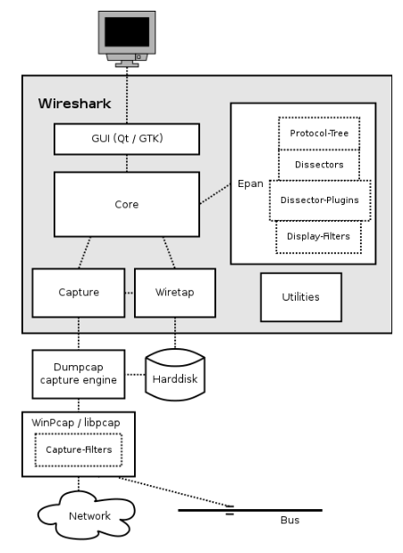

## Question 1: 
--------------------

### network security tools

www.sectools.org offers a rich catalogue of network security tools, including their classification, ratings, links to the tool’s website and reviews. Visit the website and pick one network security tool. Ensure that you select a tool that is used for ethical hacking and network administration.  Conduct an exploration of the tool and write a short summary report on the tool. In your report, you must describe:

   1.   The tool’s features,

   2.   what it provides,

   3.	How it works,

   4.	outline how it is useful to a network security specialist and

   5.	How it may be used for harmful purposes by a hacker.

____________________

**Answer:**

## Wireshark tool features

1. * Wireshark is an open-source network software, which is designed to track network packets and through the use of different filter options available in the software, it offers a series of different display filters to transform each captured packet into a readable format. This allows users to identify the cause of network security issues and even discover potential cybercriminal activity.

2. * Wireshark uses :

   - Used to analyse network packets in real-time for Windows, Mac, Unix, and Linux systems.

   - Troubleshoot network issues which are often used by different engineers to test whether the software or a network device is susceptible to an attack.

   - Check malicious and hacking possibilities on the network.

   - Identify unauthorized data exfiltration.

   - Tracing voice over Internet (VoIP) calls over the network

3. * Access Wireshark software:

  - you can directly Access Wireshark software website www.wireshark.org 

  - download the most suitable version for computer device or labtop. -> then install it.

  - Wireshark intercepts traffic and converts that binary traffic into human-readable format. This makes it easy to identify what traffic is crossing your network, how much of it, how frequently, how much latency there is between certain hops.

  - the computer have a piece of hardware called a Network Interface Controller (NIC). The NIC is responsible for connecting computer to a network. Every NIC has a unique MAC address assigned to it at the time of production. Usually NIC will only capture packets that are destined for MAC address. 

  - Wireshark places device’s NIC into “promiscuous mode”. This allows NIC to capture all packets in network regardless of whether they are intended for device. The network traffic gets forwarded to the CPU, and Wireshark is able to store and display this data using a Graphical User Interface. Data can be captured from Wi-Fi, Ethernet, Bluetooth and more. 

  

4. * Wireshark is often the best tool for troubleshooting issues on your network. It lets you put your network traffic under a microscope, and provides tools to filter and drill down into that traffic, zooming in on the root cause of the problem. Administrators use it to identify hacking attempts against your organization.

  * Wireshark supports more than two thousand network protocols, The majority of the packets on your network are likely to be TCP, UDP, and ICMP.

  * Wireshark's tools help you filter traffic are what make it especially useful. Capture filters will collect only the types of traffic you're interested in, and display filters will help you zoom in on the traffic you want to inspect. The network protocol analyzer provides search tools
 
5. Wireshark can be used as a tool for hackers. This usually involves reading and writing data transmitted over an unsecure or compromised network. Nefarious actors may seek out confidential data such as credit-card information, passwords, search queries, private messages, emails, financial transactions, and more. Data is sent over an unsecure network (such as Telnet, FTP, HTTP) in plain text form.

____________________________

**GO TO:**

[Question 2 : Classical Encryption Techniques Cryptoanalysis](/Questions%20/Question-2.md)

[Question 3 : Encryption using a block cipher ](/Questions%20/Question-3.md)

[Question 4 : Encryption using Openssl tool](/Questions%20/Question-4.md)