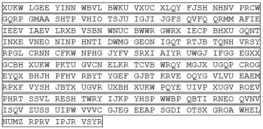
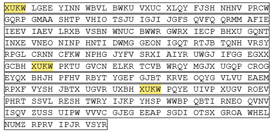
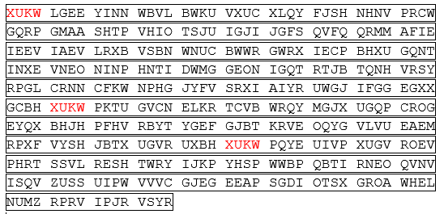
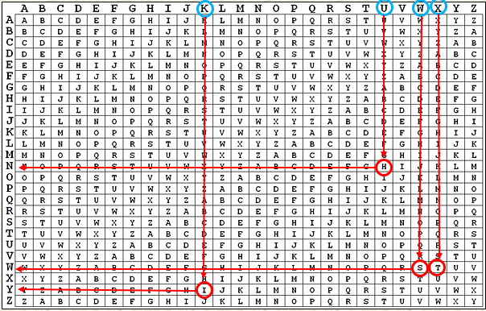
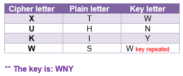
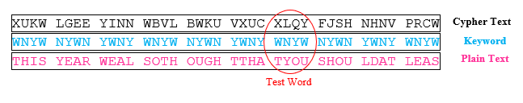
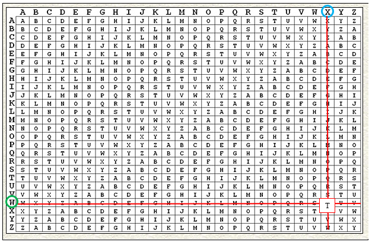
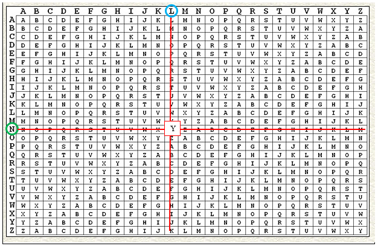
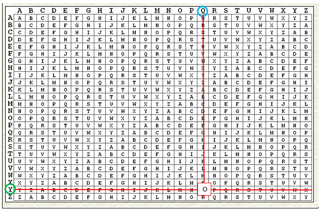

## Question 2: 
--------------------

### Classical Encryption Techniques Cryptoanalysis 

The following ciphertext was encrypted using the Vigenère Cipher, where all spaces
and punctuation were removed. Decrypt it, without using any tool and explain in details your steps to decrypt .

_________________

**Answer:**

* **At first I want to find the keyword to find the key.**

* **Most of the basic letters in the English language are repeated in texts
Like: (the, and, that, this ,Those, ...)**

* **The first **_XUKW_** cipherword is repeated in the ciphertext three times as shown in the image.**

* **The frequently English letter  used 4-letter  is _THIS_**. 

* **Then when use **_Vigenère Cipher table_** to find the key:**

* **then match each letter in **_XUKW_** word with each letter in **_THIS_** word.**

* **To decrypt all the text, pick a letter in the ciphertext and its corresponding letter in the keyword, and reapeting the keyword to finish text length**

* **Find the intersection of the letter of the encoded word by dropping a column of it with the letter of the keyword by extending a horizontal line from it.**

* **After using the same method for all letters this is the **plaintext** output.**

THIS YEAR WEAL SOTH OUGH TTHA TYOU SHOU LDAT LEAS
TONC EINY OURL IFEB ROWS ETHE WEBF ORSO MEKI NDER
GART ENCR YPTO TOOL SASY OUSE ESEV ERAL OFTH EMAR
EAVA ILAB LEAN DARE QUIT EABL ETOP ERFO RMAF REQU
ENCY ANAL YSIS ANDT HUST OEVE NGUE SSTH ESEC RETK
EYOF THIS CIPH ERPL AYIN GARO UNDW ITHT HEMC ANBE
ALOT OFFU NBUT NOWP LEAS EFOR GETA BOUT THIS ANCI
ENTS TUFF FORT HERE STOF THIS COUR SEIN THER EMAI
NDER OFTH ECOU RSEW EWIL LFOC USON MORE ELAB ORAT
EFOR MSOF SECU RITY THAT CANN OTBE BROK ENBY SUCH
ASIM PLET ECHN IQUE

* **then converting text into readble words:**

THIS YEAR WE ALSO THOUGHT THAT YOU SHOULD AT LEAST ONCE IN YOUR LIFE BROWSE THE WEB FOR SOME KIND ERGART ENCRYPTO TOOLS AS YOU SEE SEVERAL OF THEM ARE AVAILABLE AND ARE QUITE ABLE TRM ER FORMA FREQUENCY ANALYSIS AND THUS TO EVEN GUESS THE SECRET KEY OF THIS CIPHER PLAYING AROUND WITH THEM CAN BE ALOT OF FUN BUT NOW PLEASE FOR GET ABOUT THIS ANCIENT STUFF FOR THE RESTOF THIS COURSE IN THE REMAINDER OF THE COURSE WE WILL FOCUS ON MORE ELABORATE FORMS OF SECURITY THAT CAN NOT BE BROKEN BY SUCH A SIMPLE TECHNIQUE

_________________

[Question 1 : network security tools](/Questions%20/Question-1.md)

[Question 3 : Encryption using a block cipher ](/Questions%20/Question-3.md)

[Question 4 : Encryption using Openssl tool](/Questions%20/Question-4.md)