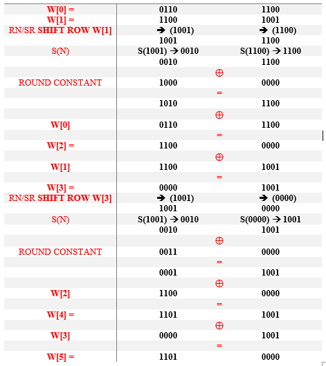

## Question 3: 
--------------------

### Encryption using a block cipher 

**a.** You have a (single block) ciphertext message (in binary): 1000 1011 0111 1010.Use your Student ID number to obtain a 16-bit key as follows: Key (in decimal) = ID mod 65536. Using Simplified AES (S-AES) manually decrypt the ciphertext using your key. You must show and explain all steps in your decryption

**b.**	Compare AES to DES. For each of the following elements of DES, indicate the comparable element in AES or explain why it is not needed in AES.

   1. XOR of the f function output with the left half of the block
   
   2. The f function

   3. Permutation P

   4. Swapping of halves of the block

_________________________

**a**
**Advanced Encryption Standard Block Cipher (Simplified AES)**

* ciphertext message (in binary): 1000 1011 0111 1010

* Key: ( **2190537** MOD 65536 ) = (27849)10 → (0110 1100 1100 1001)2

**Step1:**  Key Schedule

-> 	Split key into 2 words : W[0] , W[1]

Key = (0110 1100 1100 1001)
**W[0]** = 0110 1100
**W[1]** = 1100 1001

**Step2:**  find W[2] , W[3] , W[4] , W[5] to make key1 & key 2

**Step3:** **Decipher**
Ciphertext (CT) -> Ak0 -> Nibble Substitution (NS) -> Shift Row (SR) -> Mix Columns  (MC) -> Ak1 -> Nibble Substitution (NS) -> Shift Row (SR) -> Ak2 -> Plaintext

 

 

 

 

**Plain Text = 1111 0000 0000 1010**

**b** 

AES is more secure than the DES cipher and is the de facto world standard. DES can be broken easily as it has known vulnerabilities.

1. There is no similar element in AES for XOR the f function output with left half side of the block, this is because AES structure is not a feistel structure. The entire block is processed in parallel. 

2. There is no single element that is similar to f function, but the four stages (Substitution bytes, shift rows, mix columns, added roundly) in each round do the same as f function.

3. The similar element for P is the shift rows in each of the 10 rounds.

4. No similar element in AES this is because that AES structure not a feistel structure and no need to swap halves since work in parallel.

[Question 1 : network security tools](/Questions%20/Question-1.md)

[Question 2 : Classical Encryption Techniques Cryptoanalysis](/Questions%20/Question-2.md)

[Question 4 : Encryption using Openssl tool](/Questions%20/Question-4.md)