## Question 4: 
--------------------

### Encryption using Openssl tool [20 Marks]

a.	**Task 1.** Create two plaintext files(2 Marks) 

   1. **name.txt**: a text file containing the first 8 characters of your name. The file should be exactly 8 Bytes in length. There must be no newline character.
   2. **repeated.txt**: a text file containing the first 8 characters of your name, repeated 10 times. The file should be exactly 80 Bytes in length. There must be no newline character.
   
Also choose a random key to be used for DES, and save the 16 digit hexadecimal value in a file key.txt. There are different ways to generate a random value, an easy way is to use openssl rand (try man rand for an explanation).

b.	**Task 2.** Encrypt the first plaintext file, name.txt using DES, your key and ECB mode of operation. The ciphertext should be in a file named name.enc. Look at the binary version of the file. Note that OpenSSL adds a 1 Byte integrity check to the end of the ciphertext. you can ignore these last 8 Bytes.SG 2012-12-07: To avoid the integrity check, which may cause confusion later, use the nopad option. Create a text file, discussion.txt, and include the exact command you used to encrypt the first plaintext file. (3 Marks)

c.	**Task 3.** Determine if the avalanche effect is present in the cipher when different key values are used. (Remember to ignore the last 8 Bytes of ciphertext - the integrity check - when comparing values). You should try at least 3 different keys. In the file discussion.txt, add an explanation of how you tested for the avalanche effect (including the keys you used), your results and conclusions. You don't have to study the avalanche effect with different plaintexts - only with different keys. (SG 2012-12-10: Be careful when changing the key: recall that DES takes a 64-bit key as input but only uses 56 of those bits in the encryption - 8 bits are used for parity check. So when changing the key, make sure you change one of the 56 bits. The 8th, 16th, 24th, ...64th bit of the input key are not used in encryption). (6 Marks)

d.	**Task 4.** Encrypt the second plaintext file, repeated.txt, using DES, the same key and with three different modes of operation: ECB, CBC and OFB. Save the ciphertext as repeated-ecb.enc, repeated-cbc.enc and repeated-ofb.enc. Look at the output binary values and in the file discussion.txt, comment on the different binary values (i.e. do you notice anything about them?). (3 Marks)

e.	**Task 5.** In each of the 3 ciphertext files from Task 4, modify 1 bit in the first byte, creating three new files: repeated-ecb-mod.enc, repeated-cbc mod.enc and repeated-ofb-mod.enc. (3 Marks)

f.	**Task 6.** Decrypt the 6 ciphertext files, saving the output of each as decrypt-ecb.txt, decrypt-cbc.txt, decrypt-ofb.txt, decrypt-ecb-mod.txt, decrypt-cbc-mod.txt and decrypt-ofb-mod.txt. please add your comments on the decrypted values. (3 Marks)

Explain your notes/comments from the different tasks. you may include copy-and-paste of output of your commands or print screen if it is useful in the explanation. Also must clarify in details your changes in each round when you solve task3.It is recommended to write down all the results of your steps in a table. also you have to submit one zip file after naming it Q4-[yourid]-[name] the zip file contains the following  files.
1.	name.txt
2.	repeated.txt
3.	key.txt
4.	name.enc
5.	repeated-ecb.enc
6.	repeated-cbc.enc
7.	repeated-ofb.enc
8.	repeated-ecb-mod.enc
9.	repeated-cbc-mod.enc
10.	repeated-ofb-mod.enc
11.	decrypt-ecb.txt
12.	decrypt-cbc.txt
13.	decrypt-ofb.txt
14.	decrypt-ecb-mod.txt
15.	decrypt-cbc-mod.txt
16.	decrypt-ofb-mod.txt

____________________________
## I solved the question by using VS code & Ubunto terminal.

**Task 1: & Task 2:**

* form this command I can show all mode of operation/ encryption cipher :
> ~ openssl list -cipher-commands

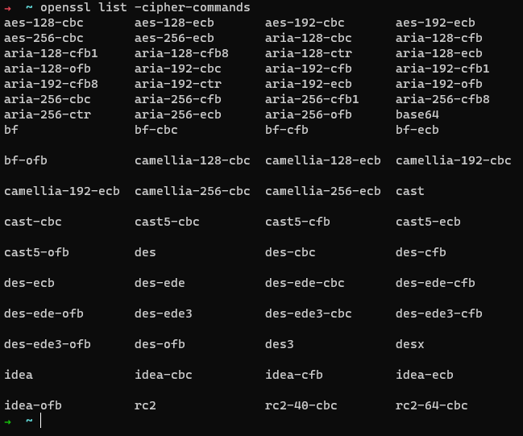

* name.txt: a text file containing the first 8 characters of my name.

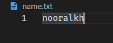

* repeated.txt: a text file containing the first 8 characters of your name, repeated 10 times.

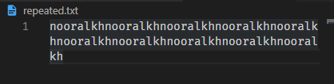

* then I use the site https://www.browserling.com/tools/random-hex to make random hex. key

* I will choose the first one and put it in a file key.txt

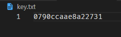

* Encrypt the name.txt file, using DES by using this command:
> ✗ openssl des -a -salt -in name.txt -out name.enc

 - a : means that the encypted output will be base64 encoded this is optional.
 - salt : adds strength to the encryption and should always be used.

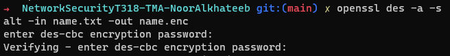

* After that, the output file **name.enc** is automatically created .
As we can see in the picture.

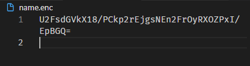

* IF I change the mode encryption cipher from **DES to DES-CBC**: 

> openssl DES-CBC -a -salt -in name.txt -out name.enc2

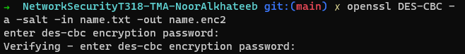

* We notice a slight difference in the ciphertext

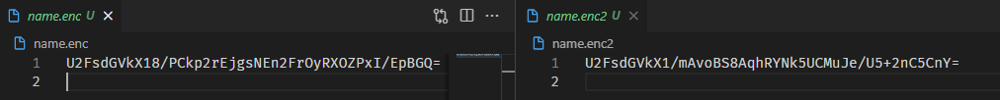

**Task 3:** different keys :

I will use these keys for comparison: 

key 1: 3c5b47bf632f43fc
key 2: 1628ae9b7fd305ea
key 3: bc1e22805891d808

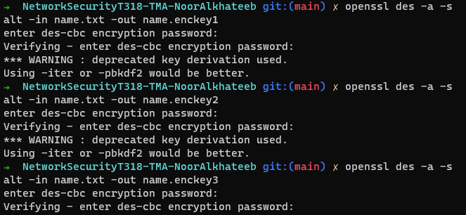

* After encrypting the same text using different keys, we notice, as in the picture, that the encrypted text is different when the key is different

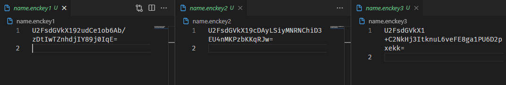

* when I use the same key I used befor **0790ccaae8a22731** but with different in one char:
key 4: 0790ccaae8a22731
key 5: 0791ccaae8a22731
key 6: 0790ccabe8a22731

> openssl DES-ECB -a -salt -in name.txt -out name.enckey4

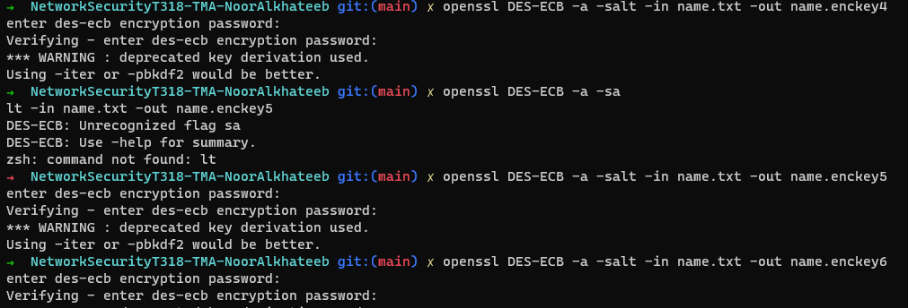

and this is the output

* **in this simple test we see characteristics of the avalanche effect in DES.**

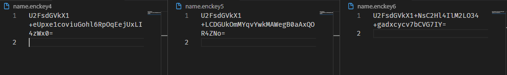

* A good cipher should produce pseudo-random output in the ciphertext. If the output is (pseudo-)random, then with two similar input plaintexts, then the output ciphertexts should be significantly different in most cases. One way to measure the difference of two ciphertexts is to count the number of bits that differ. On average, half of the bits should be different. This effect, a small change in the input produces a large change in the output, is referred to as the avalanche effect.

**Task 4:**

Encrypt the repeated.txt file, using DES, the same key **0790ccaae8a22731** and with three different modes of operation: ECB, CBC and OFB.

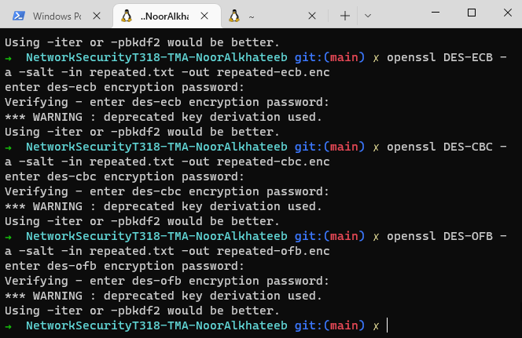

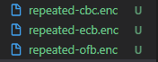

* When using the same key with a difference modes of operation We see that the ciphertext had a different value each time

**Task 5:**
I created three new file (repeated-ecb-mod.enc, repeated-cbc mod.enc and repeated-ofb-mod.enc.) and inside each of them I put 3 ciphertext files from Task 4 with modified (Modify the first letter instead of U to A). as shown in the below picture.

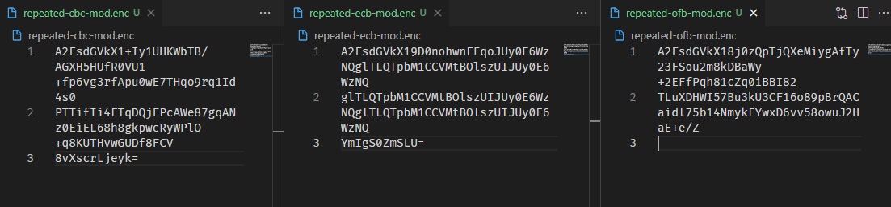

**Task 6:**

* the first thing, I will Decrypt the first three ciphertext files, saving the output of each as decrypt-ecb.txt, decrypt-cbc.txt, decrypt-ofb.txt. 
the decrypt command : 

> openssl DES-ECB -a -salt -d -in repeated-ecb.enc -out decrypt-ecb.txt

> openssl DES-CBC -a -salt -d -in repeated-cbc.enc -out decrypt-cbc.txt

> openssl DES-OFB -a -salt -d -in repeated-ofb.enc -out decrypt-ofb.txt 

* I use the same key **0790ccaae8a22731**

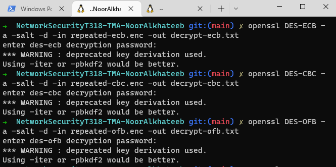

* the result is :
**When Decrypting, we notice that the original text appeared as it is**

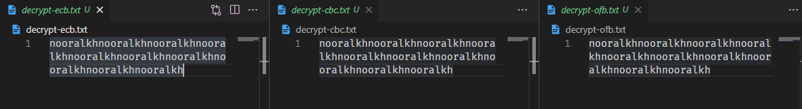

* then I will Decrypt the second three modified ciphertext files and saving the output in : decrypt-ecb-mod.txt, decrypt-cbc-mod.txt and decrypt-ofb-mod.txt.

When Decrypting, we notice that the original text appeared as it is

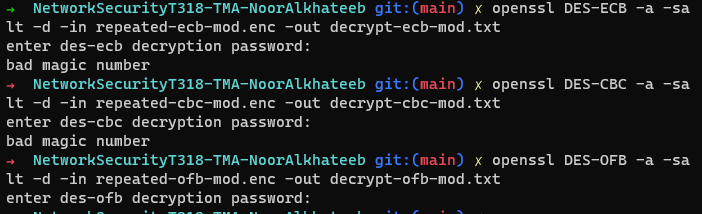

**When decrypting the modified ciphertext, the output is an error or an empty file, As it is in the picture.**

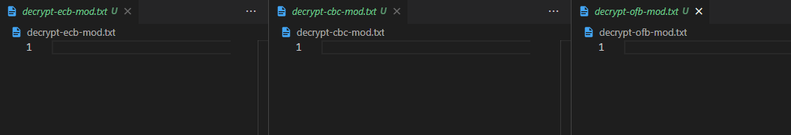

* **It is supposed to get a plain text, but it is wrong, but only an empty file appeared with me during my solution!!**

this is the explination: 
and the explination from https://sandilands.info/sgordon/teaching/css322y12s2/hw3-answers.html

______________

In each case, 

Using ECB, each block of ciphertext is decrypted independently. So the when there is an error in a ciphertext block, the resulting plaintext from decryption will also be wrong. Because DES exhibits the avalanche effect, just a single bit difference in input ciphertext, produces a significantly different output plaintext. For subsequent blocks of ciphertext, where there are no bit errors, because each block is decrypted independently, the correct plaintext is obtained. So ECB contains the 1-bit error in 1 block.

Using CBC, the first block of ciphertext is decrypted using DES, producing the wrong plaintext block. But recall from how CBC works, in decryption, the first ciphertext block is then XORed with the output of the DES decryption of the second ciphertext block. So although the second ciphertext block has no errors, the XOR with the first ciphertext block introduces errors in the resulting second block of plaintext. Specifically, the one bit that is in error in the first block of ciphertext, produces an error in the same position in the second block of plaintext. So with CBC, a 1-bit error in the first block produces an error in 1 block of plaintext AND a 1-bit error in the second block of plaintext.

Using OFB, a nonce or the previous value of DES output is used as input to DES, then the result is XORed with the ciphertext block. So when the first block of ciphertext is used in the XOR, the one bit in error will produce an error in the corresponding bit of the plaintext. For the next block, only the second block of ciphertext is used in the XOR - it is not dependent on the first (errored block), and hence no errors in the second block of plaintext. So with OFB, a 1-bit error in the first block of ciphertext produces a 1-bit error in the first block of plaintext only.

__________________________

____________________________

[Question 1 : network security tools](/Questions%20/Question-1.md)

[Question 2 : Classical Encryption Techniques Cryptoanalysis](/Questions%20/Question-2.md)

[Question 3 : Encryption using a block cipher ](/Questions%20/Question-3.md)

